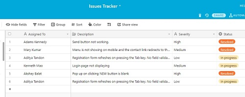
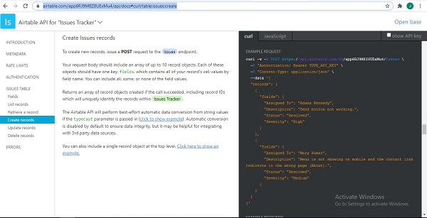
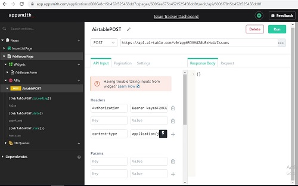

The Issue Tracker tool we will be building in this tutorial can be used by a tech support team in any organization to track and resolve complains and issues as raised by customers or users of a particular software product. Below are images of the finished tracker:

The Tracker will be build using Appsmith – a JavaScript based development platform used for building internal tools swiftly and Airtable – a cloud database service.

## First Things First

Before you start building, first do the following;

1. Visit this [link](https://app.appsmith.com/user/signup?) to Sign Up for a free Appsmith account (that is if you don’t have one already. If you do, proceed to the next item)
2. [Sign Up](https://airtable.com/signup) for the free version of an Airtable account
3. Sign into your airtable account after confirming your e-mail and click on Add a base from the My First Workspace section of your account. Create a database that has the same structure like the one in the image below;

**STEP 1:** Sign into your Appsmith account and click on Create New under your personal organization

You will be re-directed to a new page for the new app

**STEP 2:** The new app is created with the default name **Untitled Application 1**. Rename it to **Issue Tracker Dashboard**.

The new app by default comes with new directories as seen in the image below

**Pages** is the container for all the pages of your app. **Page1** is the container holding the following entities;

**Widgets**, a container for all the widgets that will be used on Page1,

**APIs**, a container for all APIs that Page1 connects to,

**DB Queries**, a container for all databases and their queries used by Page1 to read and write data.

The Issue Tracker app will contain 2 pages. The first page will list all the issues that have been submitted and the second page will contain the add issue form for submitting new issues.

**STEP 3:** Rename Page1 to **IssuesListPage**

**STEP 4:** Set up the required API for connecting to the Airtable database which allows for connection using REST API. Click [here](https://airtable.com/api) to view the API documentation on how to setup a GET request to the Issues (table in the **Issues Tracker database**) endpoint. In appsmith, Click on **+** to the right of **APIs**. Then click **Create new (IssuesListPage > APIs > Create new)**.

**STEP 5:** Rename your API to **AirtableGET**, copy and paste the URL from Airtable API documentation and enter **Authorization** and **Bearer API_KEY** under **Headers** as shown in the image below:

**STEP6:** Click on + to the right of **Widgets**, to add a **TABLE** widget **(IssuesListPage > Widgets)**. Drag and drop the **TABLE** widget to the canvas on your right. This will create a new table.

**STEP7:** Click on **Table1** in the left panel to open the property-pane of the table widget. In the property-pane, click on **Table1** to change its name to **IssuesTable**.

**STEP8:** Select and delete all the content of Table Data in the table’s property-pane and write in the below JavaScript code in between double curly braces: 

_**AirtableGET.data.records.map(item => item.fields)**_

This will link up your table to the API data pulled in from Airtable. If you have followed the steps correctly up to this point, you should be able to see the records from airtable displayed in the **IssuesTable** like in the image below:

**STEP9:** Next, we add the second page of our application that will contain the add issue form. Click on **IssuesListPage** to minimize it.

**STEP10:** Click on **+** beside **Pages** to add a new page to the app.

**STEP11:** Rename the new page to **AddIssuesPage**.

**STEP12:** Click on **+** beside **Widgets** to add a new widget.

**STEP13:** Drag and Drop the **FORM** widget unto the canvas.

**STEP14:** On the left panel click **Form1** to open its property-pane.

**STEP15:** In the property-pane, rename **Form1** to **IssuesForm**, change Background Color from white to #D9D9D9

**STEP16:** Click on **Form** at the top of the form and rename it to **Add Isssue**

**STEP17:** Drag and drop the **RICH TEXT EDITOR** widget unto the form and, inside its property-pane, rename it to **DescriptionInput**.  Drag and drop the **TEXT** widget above the **DescriptionInput** field and rename it to **Description**: 

**STEP18:** Drag and drop the **DROPDOWN** widget unto the form (below **DescriptionInput**) and, inside its property-pane, rename it to **SeverityDropdown**.  Drag and drop the **TEXT** widget above **SeverityDropdown** field and rename it to **Severity:**

**STEP19:** Drag and drop the **INPUT** widget unto the form (below **SeverityDropdown**) and, inside its property-pane, rename it to **AssignToInput**.  Drag and drop the **TEXT** widget above **AssignToInput** field and rename it to **Assign To:**

**STEP20:** Delete the **RESET** button and rename the text value of the **SUBMIT** button (in its property-pane) to **Add Issue**.

If you followed up to this stage without missing a step, you should have a form similar to the one in the image below;

**STEP21:** Next, Click on **+** beside **APIs** under the **AddIssuesPage** **(AddIssuesPage > APIs > Create new)** to set up a **POST** request to update the airtable database whenever the form is filled and submitted.

**STEP22:** Visit [https://airtable.com/api](https://airtable.com/api), click the database name (**Issue Tracker**) and navigate to the **Issues Table** section to view the API documentation on how to make a POST request to the **Issues** endpoint;

**STEP23:** Rename the **API** to **AirtablePOST** and fill in the **URL**, **Headers** and **body** as shown in the images below;

**STEP24:** On the **AddIssuesForm** open the property-pane of the **Add Issue** button and fill in the following for each of the fields;

**STEP25:** Click inside the **onClick** field, click **Call An API** and click **AirtablePOST**

**STEP26:** Click inside **onSuccess** field **(onSuccess > Show Message)** and type **Success! Issue was Added** in the message field

**STEP27:** Click inside **onError** field **(onError > Show Message)** and type **Fail! Issue was not Added** in the message field

What we’ve done above is to bind the form to the **AirtablePOST** so that each time the fields in **AddIssuesForm** are filled and submitted (by clicking the **Add Issue** button), the **AirtablePOST** runs, creating and setting a new record on the airtable database. Then we added success and error messages to alert us if the issue was added successfully or if it was not.

Now the **Issue Tracker** app is functional. Deploy it and try adding an issue. Then open the **IssuesListPage** to verify it was added. Also open the Airtable database to confirm the record has been added.

## Links To Video Tutorial
1. [Part 1](https://bit.ly/32Xl29q)
2. [Part 2](https://bit.ly/3aPzAw4)

**Mantoss**
