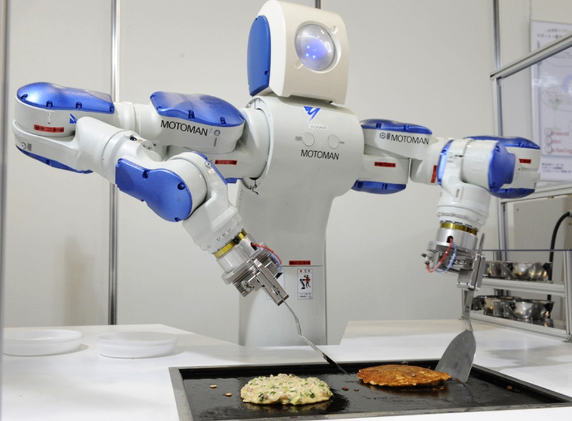

“Artificial intelligence will reach human levels by around 2029. Follow that out further to say, 2045, we will have multiplied the intelligence, the human biological machine intelligence of our civilization a billion-fold.” – Ray Kurzweil (Futurist and Inventor)

Artificial intelligence (AI) is one of my biggest fascinations. My earliest memory of a machine behaving like human was from the 80s TV series ‘Knight Rider’. Since then the thought of a hunk of metallic device laced with a software doing things people do, on its own, has always been exciting to me.

The idea of non-living things becoming alive as intelligent beings has existed for centuries. For instance, the ancient Greeks, Chinese and Egyptians had myths about robots.

The genesis of modern AI has roots in classical philosophy where human thinking was described as a symbolic system. But the field of AI was officially founded in 1956 in a technology conference at Dartmouth College Hanover, New Hampshire where the term ‘artificial intelligence’ was invented. Over the decades AI has evolved into a very vast and sophisticated technological field.

What is AI?

Artificial Intelligence (AI) is the imitation, by computer systems, of human intelligence processes such as learning, reasoning and self-correction. Some common AI applications include Computer vision (e.g OCR, MIA), Speech Recognition (e.g Amazon’s alexa and Apple’s siri) and Expert Systems (e,g Ross).

Purpose of AI.

The overall goal of AI is to create technology that allows computers and machines to perform in an intelligent manner.

Algorithms of AI.

An algorithm is a set of instructions for executing a task. Algorithms are mainly used for data processing, calculations and automated reasoning. If we want a computer system to know how to accomplish a chore, we need to assign it an algorithm. Computers can follow the steps in an algorithm quickly and precisely. One of the most widely used algorithms of AI is ‘Machine learning’ which involves the enhancement of new declarative knowledge and motor skills through practice.

Components of AI.

Applications:

•	Image Recognition
•	Speech Recognition
•	Chatbots
•	Natural Language Generation
•	Sentiment Analysis
•	Self-driving cars
•	Robotics

I. Model Types (Algorithms):

•	Deep Learning
•	Machine Learning
•	Neural Networks

II. Software/Hardware for Running Models:

•	GPUs
•	Parallel Processing tools
•	Cloud data storage and computing platforms

III. Languages for building Models:

•	Python
•	Java
•	Lisp
•	Prolog
•	C++

Classes of AI.

AI is classified as either ‘strong AI’ or ‘weak AI’. Strong AI (a.k.a AGI – Artificial General Intelligence) is a system with generalized human cognitive abilities. When given an unknown task, a Strong AI system will find a solution without human help. Weak AI (a.k.a Narrow AI) is a system developed and trained for a specific task. A good example of weak AI is the virtual personal assistant - Apple’s siri.

Types of AI.

According to Arend Hintze, an associate professor of integrative Biology and computer Science at the Michigan State University, AI are of four types;

REACTIVE MACHINES (TYPE I): These are purely reactive and have no ability to form memories or use past experience to guide current decisions. An example is Deep Blue, the IBM chess software that defeated world renowned grandmaster Garry Kasparov in the 90s. Deep Blue can identify players on the chess board and make predictions but has no memory and cannot remember past experience in order to decide future moves.

LIMITED MEMORY (TYPE II): These can use previous experiences to guide future decisions. A good example is the decision-making functions in self-driving cars. They observe other automobile’s speed and direction. This is not done in an instant but rather by constant identification of particular objects and monitoring them over time. These self-driving cars are pre programmed with these observations.

THEORY OF MIND (TYPE III): AIs of this type don’t exist yet. ‘Theory of mind’ is a psychological term which refers to the understanding that other people have their own beliefs, desires and intentions which influence the decisions they make. If AI systems will ever walk among us someday, they will have to comprehend and accept that each of us has thoughts, emotions and expectations for how we should be treated and they (AIs) will have to adjust their behaviours accordingly.

SELF-AWARENESS (TYPE IV): These types of AIs are also yet to become a reality. AIs of this nature are machines with a sense of self (i.e. they have consciousness). AIs with self awareness understand their current status and can use it to deduce what others are feeling.

Some Applications and Advantages:

I.	Medical application.

AI is used in detecting neurological disorders and for simulating brain functions.  A popular application of AI is seen in Radio-surgery, where tumors are operated upon without damaging the healthy surrounding tissues.

II.	In Agriculture.

Farming (agriculture) is one of the most ancient human activities in the world. Worldwide, agriculture is a $5trillion industry (Forbes, July 2019) and it’s not left out in the utilization of AI technologies where it is used for healthier crop yields, pests control, soil monitoring and organizing farm data. With the help of AI farmers can analyze a range of data like weather conditions, temperature and moisture. AI systems are also used for improving harvest quality and accuracy (Precision Agriculture: Disease-Detection, Weed-Detection, Malnutrition-Detection and automatic application of remedies).

III.	Availability.

Machines don’t need regular coffee or lunch breaks. They can be programmed to work continuously for long hours without getting tired, bored or distracted. 

IV.	Everyday application.

Smart phones and other mobile devices we use are now part of our daily lives. They’ve become a sort of necessity. If you are using any Smartphone then you have been indirectly enjoying AI technologies. GPS, Siri (iOS devices), Imaging Tagging functionality of Social media platforms like facebook and Cortana (windows) are just a few examples of AI apps present in our Smartphone.

V.	Execution of Monotonous Jobs.

Repetitive tasks are dull in nature. These kinds of jobs mostly don’t require much intelligence in between the process and therefore can be easily handled by AI systems. In fact these tasks can accomplished more satisfactorily because Machines can think much faster than humans and can even perform multiple tasks.

VI.	Office Assistance.

Some advanced business organizations are already using robotics as their customer care agents. These machines work on behalf of humans to interact with their customers using ‘avatars’. This helps to reduce the need for human resources.  

VII.	High-Risk Explorations.

AI (robotics) is used in mining and other fuel exploration exercises. They can be used in place of humans if the process or environment is hazardous. For example most NASA’s geological explorations on Mars are carried out by robots.

VIII.	Error Reduction.

Generally, the use of AI increases the chances for reaching a higher degree of accuracy with greater precision thereby keeping errors at the barest minimum.

The Future.

Andrew Yan-Tak Ng, Director of the Stanford Artificial Intelligence Lab, once described AI as the new electricity. He demonstrated that AI will soon power our affairs in society and business, radically changing our lifestyles. I agree with him. AI has already become ingrained in our lives. We converse with our smart phones (voice recognition and natural language), when we open our mail box we see a text categorization algorithm has sieved out most spam mails (we don’t have to search and delete), we ask Google anything we want and see relevant search results presented in an orderly manner with the best results at the top, and right now we are witnessing Tesla’s Autopilot pushing the frontiers of auto driving. And there are many more examples. 

I believe we have since entered the era of AI and so it’s important we know and understand, as much as we can, it’s implications in our lives.

PJ Mantoss 
(RoR Developer)
