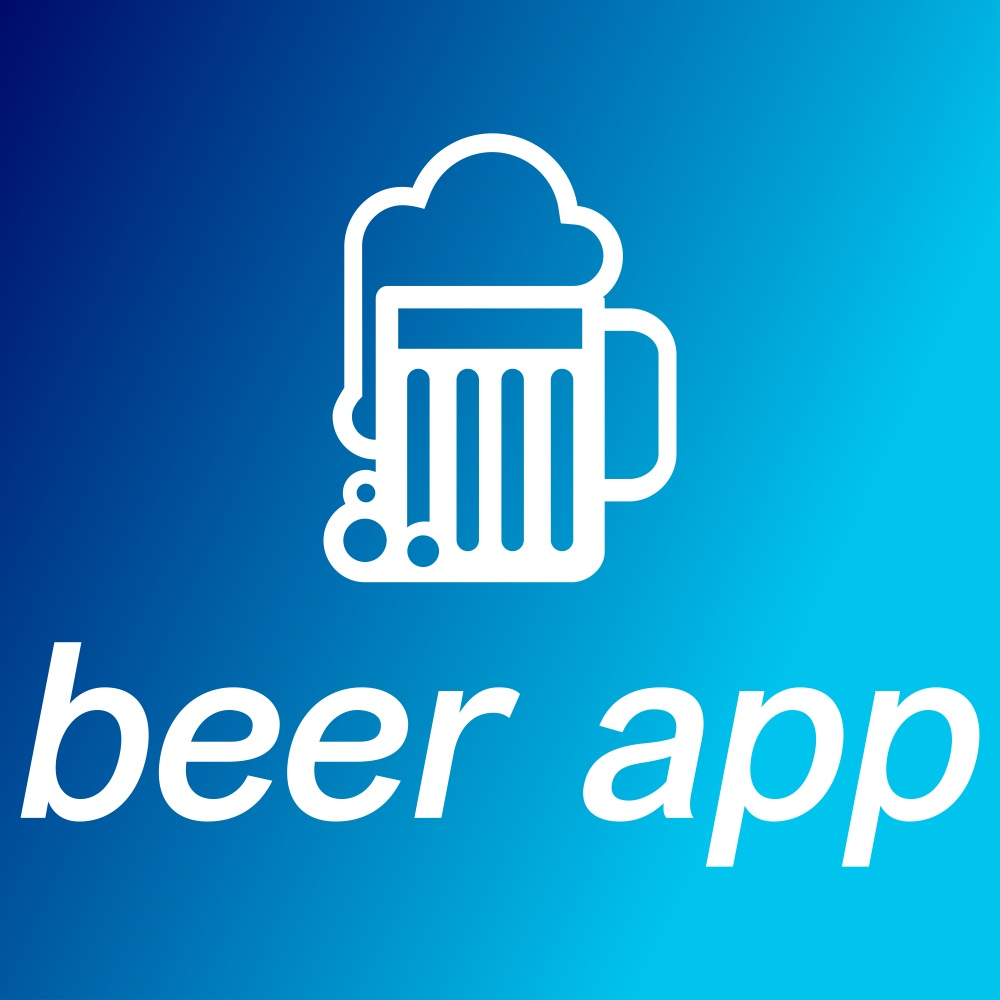
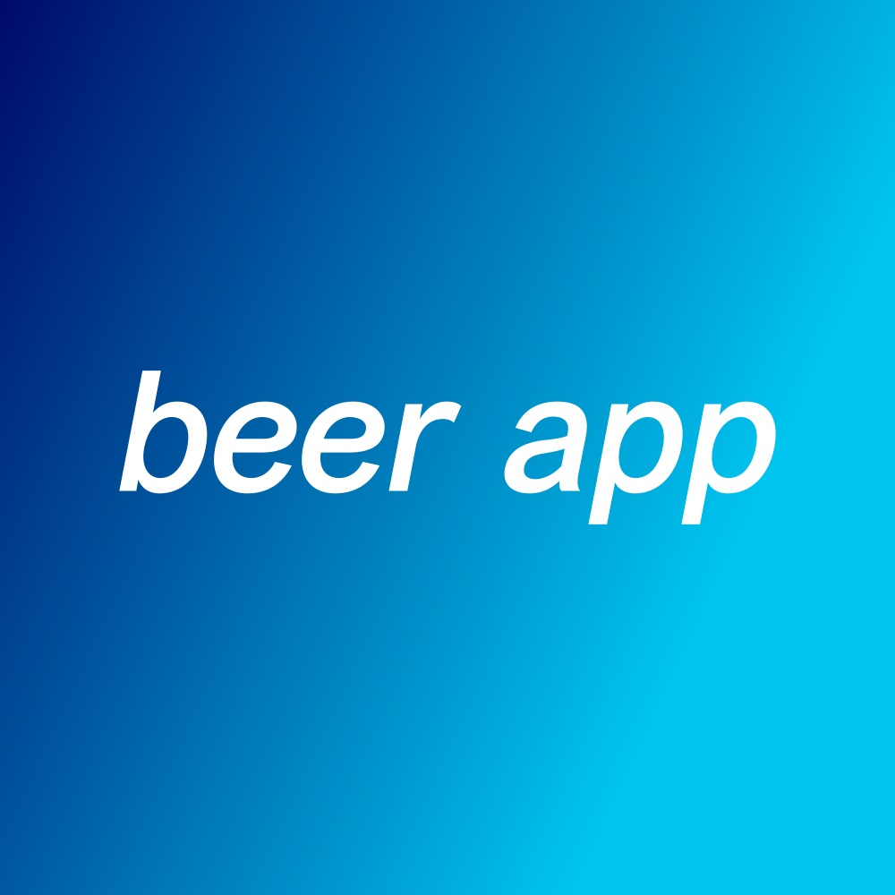

  
  

Beer App is an application that pulls in data of beers from the Punk API and filters the information based on Alcoholic volume and hoppiness.

This project was part of the Frontend Developer Career Path program at Scrimba. The aim of the project is to demonstrate the skills of working with APIs and making multiple Fetch requests using Asynchronous JavaScript.

TECH OVERVIEW

  - HTML/CSS
  - JavaScript (Async/Await)
  - Punk API

I started by building out the structure of the app (HTML), creating div containers for filters and cards to hold the beer data (Image, Name, Alcohol volume and Hoppiness), pagination buttons and footer.

I then added styling to the document, header, filters, cards, footer and pagination buttons.

Lastly I created an Async function called getBeers() that uses fetch to pull in the beer data from the Punk API. Then I rendered the beer information (Image, Name, Alcohol volume and Hoppiness) in a div that already exist in HTML.

ROADBLOCK ENCOUNTERED: I had difficulty getting and displaying the individual data (Name, Alcohol volume and Hoppiness) from the larger data object.

SOLUTION: To solve the problem I used the forEach() array method to iterate through the beer object data from the Punk API and display them in a new div container (built in JavaScript). The new div has a child div with a span to hold a beer image and the required information.

To learn more visit <a href="https://github.com/PJMantoss/beer-app"><i class="large github icon "></i>Github</a>

[Beer App Website](https://pjmantoss.github.io/beer-app/).
