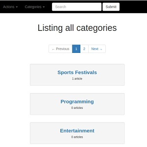
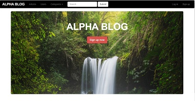
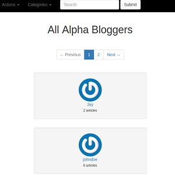
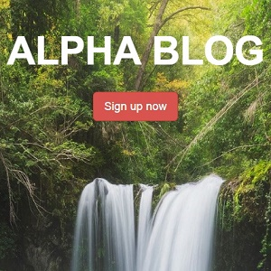

  
  
  
  

Alpha Blog is a web based application that allows users to create and manage articles. Once a new user signs up, he/she can create, edit and delete articles, view articles by other users, search for an article using several categories, edit their profile and view profiles of other users. 

For this project, I started by analyzing, reviewing and understanding the app requirements in order to determine the functionalities and features that are appropriate and needed in the software system. I then delved into the development process, using mostly the adaptive model of the RAD (Rapid Application Development) approach. I did a detailed design on a plain sheet paper to illustrate the assets and elements of the U.I.

In the development, I created the app using Rails 5, build a custom authentication system from the scratch, added styling using bootstrap classes, build one-to-many and many-to-many associations, added profile images using gravators and used pagination for listing views.

You can learn more at the [Alpha Blog Website](https://alpha-blog-mantoss.herokuapp.com).
Github Repo for [Alpha Blog](https://github.com/PJMantoss/alpha_blog).

