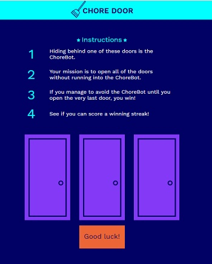

Chore Door is an interactive game. You try to evade a robot by opening three doors. The robot is behind one of the doors and tries showing when you click open a door. If you are able to evade the robot twice sucessfuly you win, if not you lose. HTML, CSS and JavaScript was used for this project.

Learn more <a href="https://github.com/PJMantoss/chore-door"><i class="large github icon"></i>Chore Door</a>
