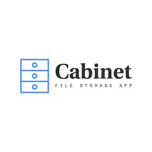

  
  

Cabinet is a note taking and file storage application software. It is a way of creating and storing documents and making them visible only to the user that created them. It enables users to capture and organize their ideas with ease. It is inspired by evernote.

In this project I started by reviewing the app requirements. I then sketched the design on a plain sheet of paper to illustrate how it would look after it is completed.

The app was created using Rails 5. An authentication system for signing up and login was build from using Devise, and Normalize was used for styling. I created two models (User and Doc) and build one-to-many associations.

Learn more at [Cabinet Website]().
Github [Link](https://github.com/PJMantoss/cabinet).

