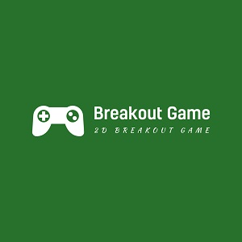

  
  

The 2D Breakout Game is a mobile responsive web game built with vanilla JS and styled with CSS.

Visit [The Website](https://pjmantoss.github.io/2D_breakout_game/).

<a href="https://github.com/PJMantoss/2D_breakout_game"><i class="large github icon "></i>Github</a>
