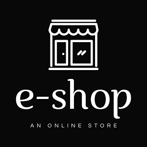
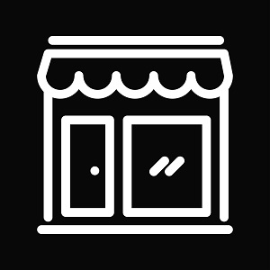

  
  

E-Shop is a client side online store built with React JS, Stripe API and styled with CSS.

Visit [The Website](https://pjmantoss.github.io/e-shop/#/).

<a href="https://github.com/PJMantoss/e-shop"><i class="large github icon "></i>Github</a>
