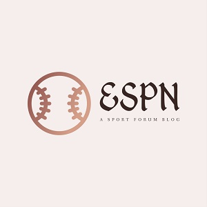
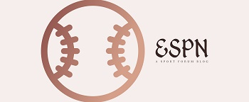

  
  

ESPN is a forum blog focusing on sports. It is inspired by Hacker News. Users can sign up and start a conversation thread or join an existing one. ESPN is built with Rails, Bootstrap (for styling) and Devise (for auth)

You can learn more at the [ESPN Website](https://espn-mantoss.herokuapp.com/).

<a href="https://github.com/PJMantoss/espn"><i class="large github icon "></i>Github</a>

