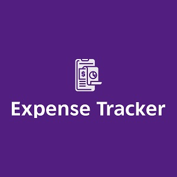

  
  

Expense Tracker is an app built with React JS and CSS. It calculates balance of income left after expenses. Functional components were used in building the entire app. As a result, React Hooks API (useState()) is used for state management throughout the project.

Visit [The Website](https://pjmantoss.github.io/expense-tracker/).

<a href="https://github.com/PJMantoss/expense-tracker"><i class="large github icon "></i>Github</a>
