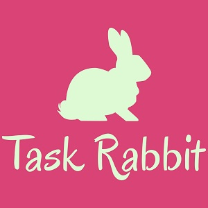

  
  

This is a taskrabbit.com and craiglist inspired project. It is build for creating, organizing and keeping track of progress on tasks based on preset categories.

You can learn more at the [Task Rabbit Website](https://taskrabbit-by-pj.herokuapp.com/).
Github Repo for [Task Rabbit](https://github.com/PJMantoss/rabbit).

