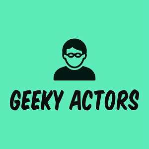
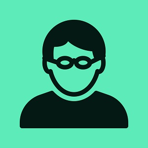

  
  

Responsive tabs and accordion designed with pure CSS.

Visit [Geeky Actor's Website](https://geeky-actors.netlify.app/).

<a href="https://github.com/PJMantoss/geeky-actors"><i class="large github icon "></i>Github</a>
