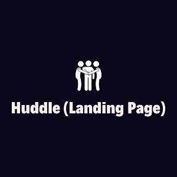
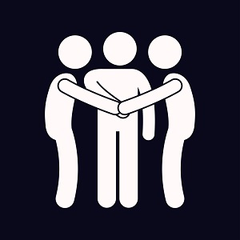

---
layout: project
type: project
image: images/huddle.jpg
title: Huddle Landing Page
permalink: projects/huddle
# All dates must be YYYY-MM-DD format!
date: 2020-02-06
labels:
  - HTML
  - CSS
  - Github
summary: A mobile responsive landing page.
---

  
  

A mobile responsive landing page with curved sections built with HTML and CSS.

Visit [huddle Website](https://huddlelanding-page.netlify.app/).

<a href="https://github.com/PJMantoss/huddle_landing_pg"><i class="large github icon "></i>Github</a>
