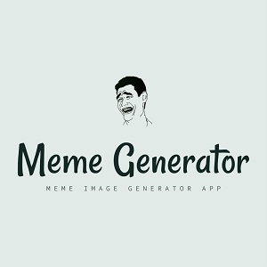

  
  

The Meme Generator is a React application that generates memes of all sorts at the click of a button. The app makes call to an API that returns a bunch of meme images.

You can learn more at the [Meme Generator Website](https://meme-gen-by-pj.netlify.com).
[Github Repo](https://github.com/PJMantoss/meme_generator) for Meme Generator.

