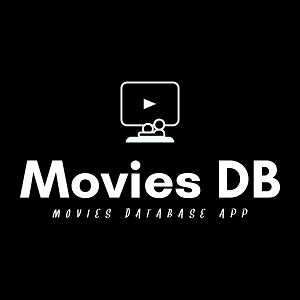

  
  

Movies Database is a web application that displays a list of Hollywood produced Movies and TV Shows. It fetches data from the TV Maze API and has a search feature. It is build with React and styled with Material-UI, Bootstrap and CSS.

[Github Repo](https://github.com/PJMantoss/movies_db) for Movies DB.
Or visit the [Movies DB Website](https://pjmantoss.github.io/movies_db).
