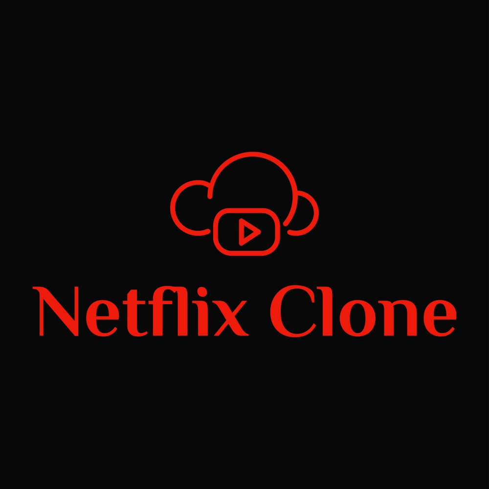
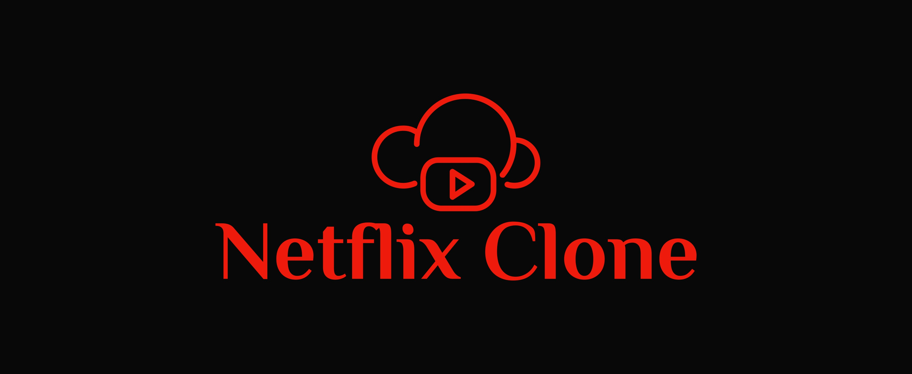

  
  

This is a React UI build to resemble netflix landing page. It returns data from the TMDB API. It is build with React and styled with CSS.

<a href="https://github.com/PJMantoss/netflix_home"><i class="large github icon "></i>Github</a>

[Netflix Home Website](https://netflix-by-mantoss.netlify.com/).
