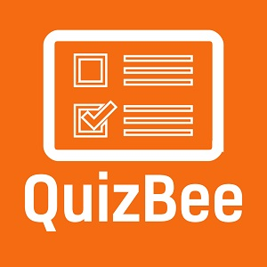

  
  

QuizBee is a quiz app built using key features of React JS such as state variables, Lifecycle methods and the Hooks API. It's styled with CSS.

Visit [QuizBee Website](https://pjmantoss.github.io/quizBee/).

<a href="https://github.com/PJMantoss/quizBee"><i class="large github icon "></i>Github</a>
