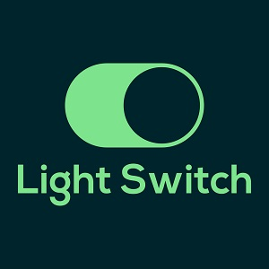
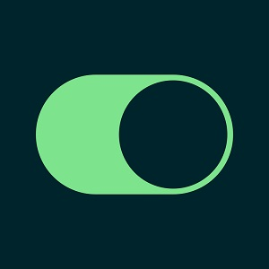

  
  

This app is a simple switch for a lightbulb SVG. It changes color depending on the value of state. It was achieved using the useState hook.

<a href="https://github.com/PJMantoss/light-switch"><i class="large github icon "></i>Github</a>

[Light Switch Website](https://light-switch.netlify.com/).
