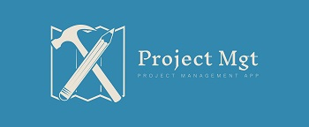

The Finance-Tracker app allows new users to register, search, add and monitor stocks in real time. It also has social media functionalities as a user can search for friends who have signed up, see the stocks they are tracking and connect with them.

It is created with Rails 5. I also used Devise was for building the authentication system and Bootstrap for styling.  
In this project I gained experience with full-stack web application design and associated technologies, including [PostgreSQL](https://www.postgresql.org/) for database storage, the [Twitter Bootstrap](http://getbootstrap.com/) CSS Framework for the user interface, Devise for building authentication system and iex-ruby-client for retrieving stock quotes. 
 
Learn more [Project Mgt Website](https://https://projectmanager-by-pj.herokuapp.com/).
<a href="https://https://github.com/PJMantoss/project_mgt"><i class="large github icon"></i>Github Repo</a>
