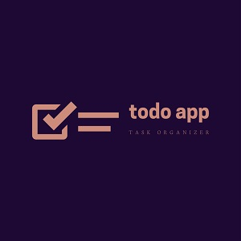

  
  

Todo is a web based tool for organizing and creating tasks. 

It is created with React JS.

You can learn more at the [Todo Website](https://todo-app-by-pj.netlify.com/).
[Github Repo](https://github.com/PJMantoss/todo_app) for Todo App.
