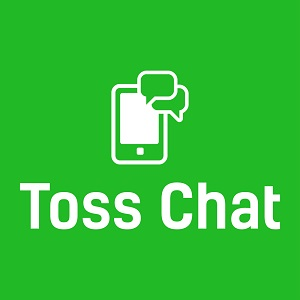

  
  

Toss Chat is a chat application built with React JS and Chatkit API. It's styled with CSS

You can learn more at the [Toss Chat Website](https://toss-chat.netlify.com/).

<a href="https://github.com/PJMantoss/toss_chat"><i class="large github icon "></i>Github</a>
