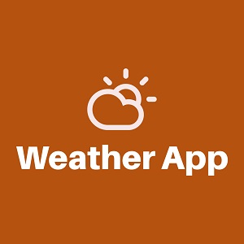

  
  

A weather app built with vanilla JavaScript and openWeather API. It is styled with CSS

Visit [Quote App Website](https://pjmantoss.github.io/weather-app-js/).

<a href="https://github.com/PJMantoss/weather-app-js"><i class="large github icon "></i>Github</a>
